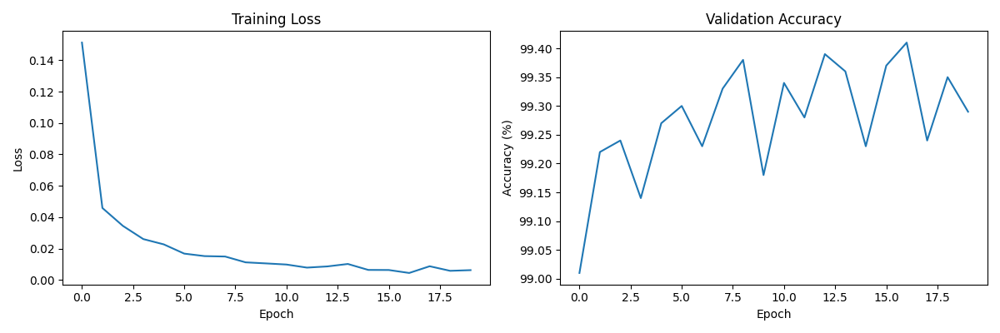
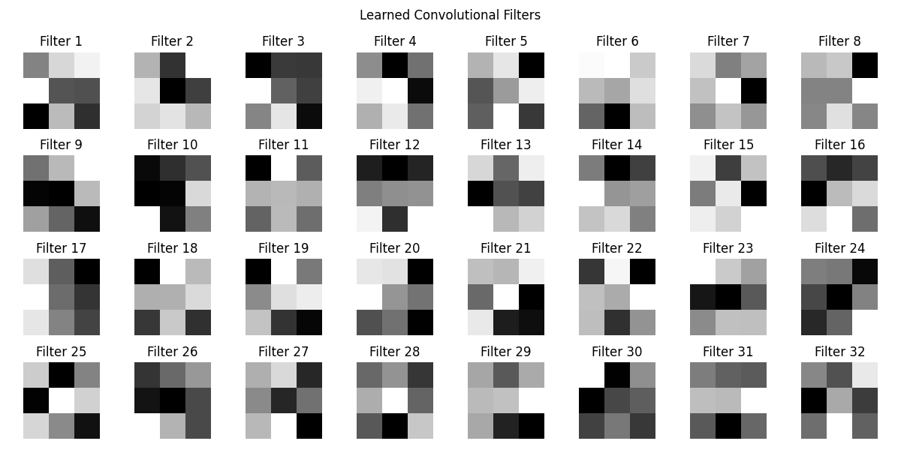
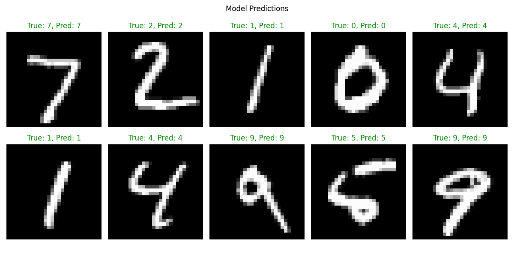

# MNIST Handwritten Digit Classification with PyTorch

This project implements a Convolutional Neural Network (CNN) using PyTorch to classify handwritten digits from the famous MNIST dataset. The model is developed and presented in a single, self-contained Jupyter Notebook (`mnist.ipynb`).

## Key Features

- **High Accuracy:** Achieves **99.41%** accuracy on the test set.
- **Efficient Training:** Implements early stopping to prevent overfitting and save computational resources.
- **Data Augmentation & Normalization:** Standard `ToTensor` and `Normalize` transforms are applied to the dataset.
- **Model Interpretability:** Visualizations are provided for:
  - Training and validation performance curves.
  - Filters learned by the first convolutional layer.
  - Model predictions on sample test images.

## Performance

The model was trained for a maximum of 20 epochs with an early stopping patience of 5 epochs. It achieved a final test accuracy of **99.41%**.

## Results & Visualizations

### Training & Validation Curves

The plot below shows the training and validation loss and accuracy over the epochs. The training stopped early, demonstrating the effectiveness of the early stopping mechanism.



### Learned Filters

These are the filters from the first convolutional layer. They represent the basic patterns the model has learned to detect, such as edges and gradients.



### Model Predictions

Here are some sample predictions from the test set, showing the image and the model's predicted label.



## How to Run

1.  **Clone the repository:**
    ```bash
    git clone <repository-url>
    cd mnist-cnn
    ```
2.  **Set up the environment and install dependencies:**
    It is recommended to use a virtual environment.
    ```bash
    python -m venv .venv
    source .venv/bin/activate
    pip install torch torchvision matplotlib tqdm jupyter
    ```
3.  **Launch Jupyter Notebook:**
    ```bash
    jupyter notebook
    ```
4.  Open `mnist.ipynb` and run the cells sequentially.

## Model Architecture

The CNN is composed of the following layers:

- **Three Convolutional Layers:**
  - `Conv2d(1, 32, kernel_size=3, padding=1)`
  - `Conv2d(32, 64, kernel_size=3, padding=1)`
  - `Conv2d(64, 128, kernel_size=3, padding=1)`
- **Max Pooling:** `MaxPool2d(kernel_size=2, stride=2)` after each convolutional layer.
- **Dropout:** `Dropout(0.5)` for regularization after the final pooling layer.
- **Two Fully Connected (Linear) Layers:**
  - `Linear(128 * 3 * 3, 128)`
  - `Linear(128, 10)` (Output layer for 10 digit classes)
- **Activation Function:** `ReLU` is used throughout the network.
- **Total Parameters:** ~3.3M
